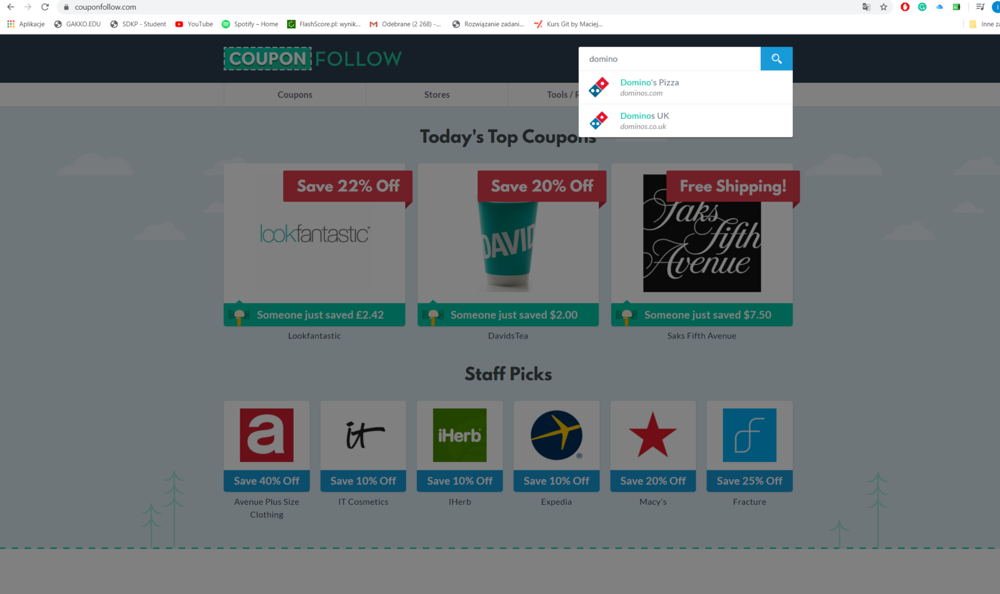

# Project Name
CouponFollow

## Table of contents
* [General info](#general-info)
* [Screenshots](#screenshots)
* [Technologies](#technologies)
* [Setup](#setup)
* [Status](#status)
* [Inspiration](#inspiration)

## General info
It is test to find coupon code for Domino Pizza using search. My main motivation was traning Page Object Model pattern.

## Screenshots

## Technologies
* Java
* Selenium WebDriver - version 3.141.59
* JUnit - version 5.3.2

## Setup
Describe how to install / setup your local environement / add link to demo version.
1. Open folder 'Selenium Server'
2. Open file 'hubstart'
3. Open file 'nodestart'
After you start tests.

## Code Examples
Test search
` @Test
    public void findCouponBrandUsingSearch() throws IOException, UnsupportedFlavorException {
        HomePage homePage = new HomePage(driver).goTo(configuration.getBaseUrl());
        int couponCode = homePage.findBrandInSearch(brandName).findCouponsCode();
        assertEquals(Integer.parseInt(configuration.getCouponCode()), couponCode, "Wrong value of coupon code");
    }`

## Status
Project is: _in progress_

## Contact
https://www.linkedin.com/in/igor-grabowski/